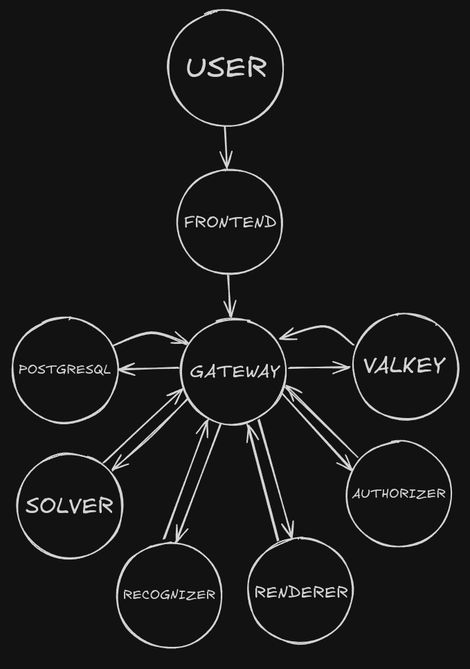
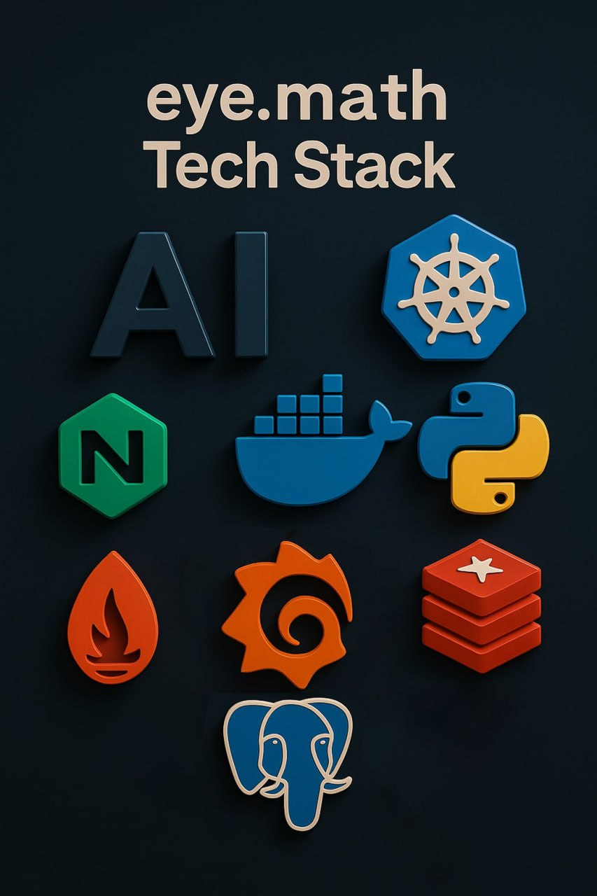

# eye.math

**Open Source AI-powered mathematical problem solver** that recognizes handwritten equations and provides step-by-step solutions with LaTeX visualization.

<p align="center">
    
</p>

## 🚀 Features

- **95% Recognition Accuracy** - Advanced computer vision models for handwritten math;
- **Lightning Fast Processing** - Sub-2 second response times;
- **Step-by-Step Solutions** - Detailed mathematical explanations;
- **LaTeX Visualization** - Professional-quality mathematical rendering;
- **Open Source** - MIT licensed, contributions welcome;
- **Modern Architecture** - Microservices with Docker & Kubernetes support.

## 🎯 Problem Solved

Most mathematical recognition services either:
- Only handle printed text accurately;
- Provide results without explanations;
- Have low accuracy (65-85%) for handwritten input;
- Lack comprehensive solution workflows.

**eye.math** bridges this gap with a complete pipeline from handwritten recognition to LaTeX visualization.

## 🎬 Showcase


## 🏗️ Architecture
<p>
    
</p>

## 🛠️ Tech Stack

<p align="center">
    
</p>

### Backend
- **Python 3.13.x** with UV, Ruff and Mypy for static typed reliable python;
- **PyTorch** with CUDA acceleration for computer vision models;
- **OpenCV** for advanced image preprocessing pipelines;
- **FastAPI** for modern REST API development;
- **PostgreSQL** for reliable data storage;
- **Valkey** for caching and session management;
- **Visma** - Open source mathematical computation engine for symbolic math;
- **Pix2Tex** - State-of-the-art handwritten math recognition model.

### Frontend
- **Vanilla JavaScript** with modern ES6+ features;
- **CSS3** with advanced animations and responsive design;
- **Vite** for fast development and building.

## 🚀 Quick Start

### Prerequisites
- Docker & Docker Compose;
### Installation

1. **Clone the repository**
```bash
git clone https://github.com/dagahan/EyeMath_backend_monorepository
cd EyeMath_backend_monorepository
```

2. **Set up environment variables**
```bash
cp .env.example .env
# Edit .env with your configuration
```

3. **Run with Docker Compose**
```bash
docker-compose  up --build
```

4. **Access the application**
- Frontend: http://localhost:4173
- API: http://localhost:9998

### Development Setup

For development with hot reload:

```bash
# Backend services
docker-compose up --build

# Frontend development server
cd frontend
npm install
npm run dev
```

## Based on:

This project is built on top of amazing open source technologies:
- **[Visma](https://github.com/aerospaceresearch/visma)** - Powerful symbolic mathematics engine that powers our solving capabilities;
- **[Pix2Tex](https://github.com/lukas-blecher/LaTeX-OCR)** - Advanced neural network for handwritten mathematical expression recognition.

## 📞 Contact

- **GitHub Issues**: [Report bugs or request features](https://github.com/dagahan/EyeMath_backend_monorepository/issues);
- **Telegram**: [nikita usov](https://t.me/usov_nikita);
- **Email**: dagahanwork@gmail.com.

---

<p align="center">
  Made with ❤️ for math by Usov Nikita.
</p>


