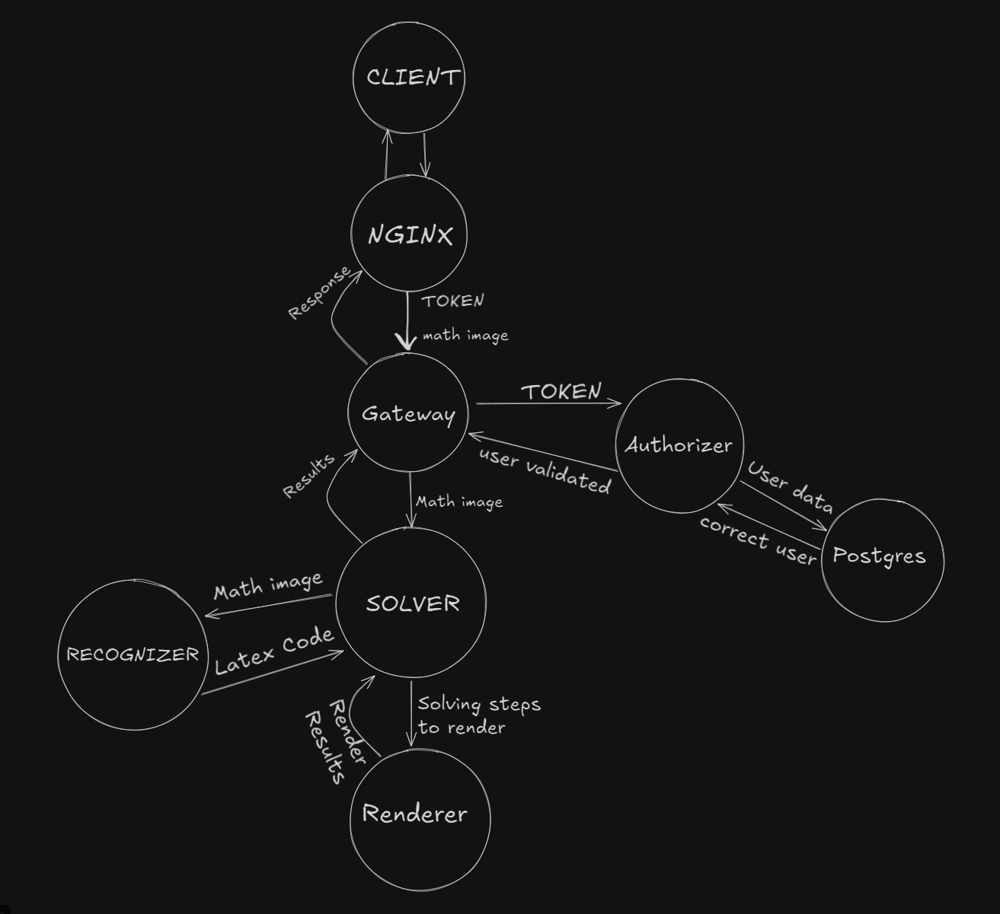
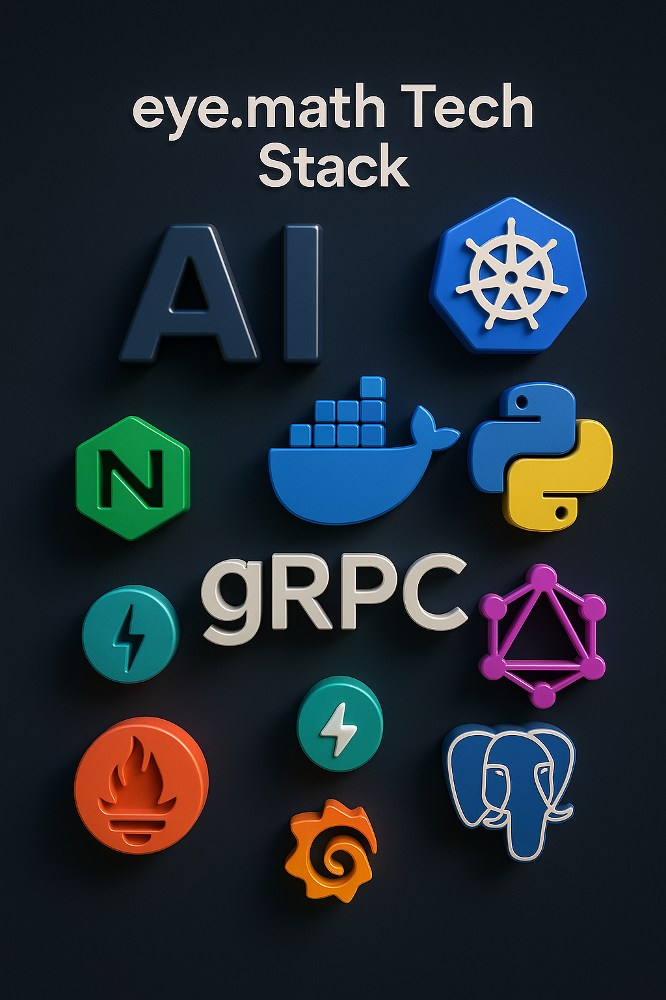

# eye.math
eye.math is a cutting-edge platform that allows users to solve handwritten mathematical problems at lightning speed.
using advanced computer vision and machine learning algorithms, the platform analyzes images and converts them into mathematical equations, which are then solved in a step-by-step process.


## eye.math showcase

video-content here.


### Diagram

<p>
    
</p>

## Architecture

### Diagram

<p>
    
</p>


## Tech Stack

### Diagram

<p>
    
</p>

* Python 3.13.x with UV, Ruff, and TY for high-performance execution;
* PyTorch with CUDA acceleration for computer vision models;
* OpenCV for advanced image preprocessing pipelines;
* Nginx as reverse proxy;
* Docker for containerization;
* Kubernetes for production orchestration;
* gRPC for lightning speed of microservices communication;
* GraphQL with FastAPI as client-api;
* PostgreSQL;
* Prometheus and Grafana for observability monitoring.

## How to run the backend on signle node?

First, clone repo and cd into it.

```bash
git clone https://github.com/dagahan/EyeMath_backend_monorepository
cd EyeMath_backend_monorepository
```

Then, install docker and docker-compose (or minikube) to your system.

```bash
sudo apt-get update
sudo apt-get install ca-certificates curl
sudo install -m 0755 -d /etc/apt/keyrings
sudo curl -fsSL https://download.docker.com/linux/ubuntu/gpg -o /etc/apt/keyrings/docker.asc
sudo chmod a+r /etc/apt/keyrings/docker.asc

echo \
  "deb [arch=$(dpkg --print-architecture) signed-by=/etc/apt/keyrings/docker.asc] https://download.docker.com/linux/ubuntu \
  $(. /etc/os-release && echo "${UBUNTU_CODENAME:-$VERSION_CODENAME}") stable" | \
  sudo tee /etc/apt/sources.list.d/docker.list > /dev/null
sudo apt-get update

sudo apt-get install docker-ce docker-ce-cli containerd.io docker-buildx-plugin docker-compose-plugin
```

You also need to create .env or pass env variables directly.

```bash
cp .env.example .env
```

Edit your environment variables with nano.

```bash
nano .env
```

Finally, run the docker compose.

```bash
sudo docker-compose --env-file .env  up --build
```

Or run minikube.

```bash
kubectl run engine=docker
kubectl apply -f ./minikube
```

Now your backend is online!

## Find a bug? 

If you found an issue or would like to submit an improvement to this project, please submit it using the issues tab above.